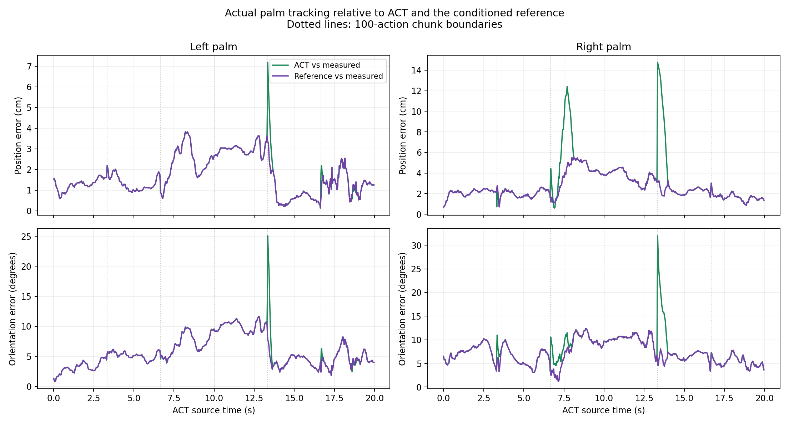

# ACT → SONIC v1.1 → G1/Dex3: joint and palm comparison

Computed 2026-09-07 from the confirmed corrected-act-run6 recording. This is a quantitative audit of the saved run; no new VLA inference or physics execution was performed.

**Result:** the composed reference arrives at the native controller unchanged. ACT angles, controller motor targets, and measured joint angles are not equal. Actual palm tracking is substantially closer to the requested pose than forward kinematics at the issued PD targets would suggest.

## Palm position and orientation

Palm poses use the G1/Dex3 model and the same measured floating base, legs, and waist at every stage. Position error is the Euclidean distance between palm origins. Orientation error is the shortest rotation angle on SO(3), not subtraction of Euler angles.

| Comparison | Hand | Position RMS (cm) | Position max (cm) | Orientation RMS (°) | Orientation max (°) |
|---|---|---:|---:|---:|---:|
| ACT target → measured pose | Left | 1.98 | 7.18 | 6.50 | 25.07 |
| ACT target → measured pose | Right | 3.84 | 14.75 | 8.47 | 31.99 |
| Conditioned reference → measured pose | Left | 1.91 | 3.83 | 6.24 | 11.66 |
| Conditioned reference → measured pose | Right | 2.83 | 5.54 | 7.64 | 12.39 |
| ACT target → issued-target FK | Left | 15.03 | 22.19 | 37.61 | 48.64 |
| ACT target → issued-target FK | Right | 21.34 | 33.81 | 43.16 | 61.81 |
| ACT target → conditioned reference | Left | 0.39 | 6.15 | 1.76 | 24.93 |
| ACT target → conditioned reference | Right | 2.44 | 13.91 | 3.63 | 29.85 |

**Issued-target FK is hypothetical:** these are poses the kinematic model would have if the joints equalled the received motor targets. They are not the physical poses reached by the robot. SONIC emits feedback-control targets for PD actuators; offsets from the desired reference can generate the torque needed for motion and support.

[All stages, including issued-target FK](hand_pose_errors.png) · [3D trajectories](hand_pose_trajectories.png) · [Pose metrics CSV](hand_pose_metrics.csv) · [All XYZ/quaternion samples](hand_pose_timeseries.csv)

## Which hand frame?

Left: `left_wrist_yaw_link` with local translation `[0.0415, 0.003, 0]` metres. Right: `right_wrist_yaw_link` with translation `[0.0415, -0.003, 0]`. Both have identity local rotation. These are the original palm mesh frames in `gear_sonic/data/robot_model/model_data/g1/g1_29dof_with_hand.xml`, not the wrist origins, a calibrated grasp TCP, or fingertip frames.

Measured poses are reconstructed from recorded MuJoCo joint positions and floating-base pose. The CSV provides world and torso-frame XYZ and unit quaternions in **wxyz** order. Retaining a common measured base/waist isolates the arms; these numbers do not measure whole-body navigation error. Palm accuracy does not establish finger or grasp accuracy.

## Per-joint angle comparison

All entries below are RMS errors in degrees over the ACT action interval. ACT is linearly interpolated from 30 Hz to each selected 50 Hz reference time before comparison. `Reference` includes the intended limits and entry/rate conditioning. All 28 named joints are compared in ACT order; right-hand middle/index runtime reordering is reversed before comparison.

| Joint | ACT → reference | ACT → issued target | ACT → measured | Reference → issued target | Reference → measured |
|---|---:|---:|---:|---:|---:|
| left_shoulder_pitch | 0.30 | 21.66 | 4.47 | 21.69 | 4.48 |
| left_shoulder_roll | 1.11 | 13.16 | 9.91 | 13.29 | 9.98 |
| left_shoulder_yaw | 0.19 | 9.78 | 11.87 | 9.77 | 11.86 |
| left_elbow | 0.34 | 12.71 | 2.48 | 12.71 | 2.41 |
| left_wrist_roll | 0.62 | 8.01 | 8.64 | 7.96 | 8.55 |
| left_wrist_pitch | 0.11 | 3.97 | 3.08 | 3.98 | 3.09 |
| left_wrist_yaw | 0.11 | 9.00 | 8.34 | 9.00 | 8.33 |
| right_shoulder_pitch | 4.81 | 20.72 | 8.94 | 20.12 | 6.90 |
| right_shoulder_roll | 0.34 | 13.74 | 6.54 | 13.74 | 6.51 |
| right_shoulder_yaw | 1.44 | 10.02 | 7.90 | 10.21 | 7.81 |
| right_elbow | 2.48 | 23.52 | 15.11 | 23.61 | 15.06 |
| right_wrist_roll | 1.15 | 6.06 | 5.16 | 6.19 | 5.07 |
| right_wrist_pitch | 1.39 | 8.19 | 8.43 | 8.19 | 8.35 |
| right_wrist_yaw | 1.19 | 3.55 | 3.95 | 3.44 | 3.81 |
| left_hand_thumb_0 | 0.01 | 0.06 | 3.02 | 0.06 | 3.02 |
| left_hand_thumb_1 | 0.00 | 0.01 | 2.14 | 0.01 | 2.14 |
| left_hand_thumb_2 | 0.62 | 0.62 | 2.92 | 0.04 | 2.71 |
| left_hand_middle_0 | 1.34 | 1.41 | 4.05 | 0.25 | 3.42 |
| left_hand_middle_1 | 0.26 | 0.26 | 2.60 | 0.05 | 2.54 |
| left_hand_index_0 | 2.50 | 2.71 | 5.31 | 0.47 | 3.77 |
| left_hand_index_1 | 1.98 | 2.19 | 4.92 | 0.50 | 3.69 |
| right_hand_thumb_0 | 0.41 | 0.46 | 3.79 | 0.12 | 3.75 |
| right_hand_thumb_1 | 0.01 | 0.02 | 5.41 | 0.01 | 5.41 |
| right_hand_thumb_2 | 0.33 | 0.40 | 3.76 | 0.15 | 3.74 |
| right_hand_index_0 | 1.51 | 4.31 | 11.61 | 4.03 | 11.37 |
| right_hand_index_1 | 6.37 | 7.10 | 12.63 | 1.81 | 8.66 |
| right_hand_middle_0 | 1.19 | 1.22 | 4.37 | 0.18 | 3.92 |
| right_hand_middle_1 | 4.55 | 5.44 | 9.36 | 1.60 | 6.29 |

[Per-joint CSV: radians/degrees, RMS/max/signed bias](per_joint.csv) · [All joint-angle samples](joint_timeseries.csv)

[Left arm plots](left_arm.png) · [Right arm plots](right_arm.png) · [Left finger plots](left_hand.png) · [Right finger plots](right_hand.png)

## Discrepancy diagnosis

1. **Reference transport passes:** all 60,157 checked values (29 body + 14 finger joints × 1,399 active native records) match the saved reference exactly: maximum absolute error **0 rad**. These records cover 1,249 distinct reference frames. Recomposition from the saved raw ACT actions and grounded baseline also exactly reproduces every saved payload array. No adapter permutation or angle-unit defect was found.

2. **Raw ACT is intentionally conditioned:** model-limit clipping changes 641 scalar values across four finger joints; arm speed is limited to 1 rad/s and finger speed to 2 rad/s. The body/finger reference has a two-second entry and terminal settle/preview padding. Those intervals are excluded from the primary metrics.

3. **Chunk boundaries matter:** both measured palm position-error maxima occur at ACT time **13.34 s**, reference frame **767**, immediately after source action **400** starts a new 100-action chunk (13.333 s). That boundary contains an arm-target jump up to **37.57°**. The rate limiter must smooth this discontinuity, producing reference lag. This explains a component of the ACT/reference mismatch; coincidence alone does not attribute the entire measured error to the boundary. Peak sample XYZ/quaternion values are in [peak_hand_errors.json](peak_hand_errors.json).

4. **SONIC is a tracking controller:** its raw decoder output has 29 normalized body actions. Native code computes `q_target_hw[i] = default_angles[i] + raw_decoder_isaac[isaaclab_to_mujoco[i]] * g1_action_scale[i]`. ACT contains 28 absolute arm/finger angles in radians. Equality between these raw representations is not expected. The saved simulation log contains received, scaled motor-position commands; it does not contain the directly recorded raw decoder tensor.

5. **Dex3 fingers bypass the learned body decoder:** their named reference targets pass to the hand DDS writer, which applies closure limits and a ±0.25 rad clamp relative to measured hand feedback. For right index-0, accounting approximately for that clamp reduces reference/issued discrepancy from 4.03° RMS to 0.21° RMS. This approximation uses simulator snapshot feedback rather than the exact writer snapshot, so it is diagnostic evidence, not proof of per-tick equality.

6. **Timestamp skew is too small to explain the arm offsets:** primary pairing uses each observation and the latest prior native record. Pairing age median **9.755601 ms**, maximum **20.067157 ms**. A fixed ±20 ms sensitivity check leaves the large arm-target RMS errors essentially unchanged. Body and hand DDS streams remain asynchronous, so the comparison cannot establish exact command causality.

**Implication for the adapter:** do not treat this run as proof of identical ACT actions or exact end-effector reproduction. The measured residual is real. The reference mapping does not need a permutation fix. Improving reproduction requires continuity across ACT chunks and measured tracking improvements. Forcing the learned controller targets to equal ACT would change the controller architecture and must be evaluated as a separate control change. No behavior change has been made in this audit.

## Scope, provenance, and reproduction

- Input: saved corrected-act-run6 ACT policy actions and SONIC v1.1 controller/simulation logs. Primary set: **977 observations**, reference frames **100–1098**, ACT time **0–19.96 s**. Statistics are observation-weighted.
- Original H100 render manifest records MuJoCo **3.12.0**. This offline analysis uses MuJoCo **3.3.7** `mj_kinematics` on the repository MJCF, with no physics integration or rendering-dependent transforms. Version and model/input hashes are included in the JSON reports; no cross-version dynamics equivalence is claimed.
- H100 SSH timed out during this audit. All calculations used the locally saved evidence. MuJoCo was installed only inside `.tmp/act-joint-audit/venv` on this Mac. No H100 host packages or processes were changed.
- Validation: **18 tests passed** across the comparator, FK, and existing ACT reference tests; read-only review found no material FK/mapping error.

See [Ubuntu reproduction and next steps](README.md) for the portable evidence archive, dependencies, commands, and continuation plan.

[Joint summary and input hashes](summary.json) · [Pose summary and model hashes](hand_pose_summary.json) · [Additional diagnostic measurements](diagnosis.json)
