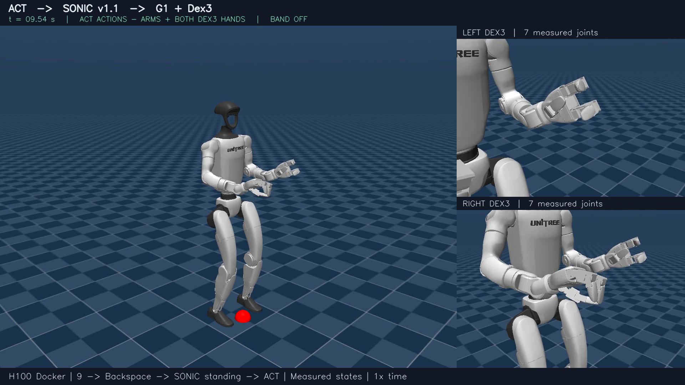

# Recorded G1 ACT replay on H100

This runbook documents a bounded, recorded-observation replay through ACT, the
SONIC adapter, and MuJoCo. It checks reference transport, startup sequencing,
lease expiry, and timing. It does not evaluate language following, task
success, or a live camera loop. The portable validation checklist is in the
[VLA adapter validation tutorial](vla_adapter_validation.md).

The measured Linux H100 run produced 600 ACT actions, 1,399 active native
ticks, 1,249 distinct replayed reference frames, and 67 expiry-hold ticks.
Across 52.80 seconds after ACT start it had no falls or automatic resets, both
feet grounded on 100% of samples, minimum base height 0.7603 m, and maximum
tilt 3.510 degrees. Maximum waist yaw, roll, and pitch were 5.091, 2.019, and
2.289 degrees. RMS joint error was 0.1188/0.1263 rad for the left/right arms
and 0.0565/0.1024 rad for the left/right hands.

All commands below are examples for a fresh deployment. Replace
GPU_DEVICE=1 when another GPU is assigned. No host port is published; the two
containers communicate over a private Docker network. Both containers must run on the same Linux host so their monotonic lease
clocks are comparable; the shared volume carries observations and run evidence.

## Inputs and images

The pinned inputs are:

- ACT checkpoint: ambitiousmangosteen/g1-dex3-toastedbread-act-las at
  570d35d5c8267b9f8f271cd3b3b53cb1af7dada1.
- Dataset: unitreerobotics/G1_Dex3_ToastedBread_Dataset at
  02cb29161f5adb2981a072aa35b408d82a556d07.
- SONIC model bundle: nvidia/GEAR-SONIC at
  6733128a3d8a523b1418b06bca3cdf61c8b0987f.

The SONIC model volume must contain these files under /artifacts/sonic-models:

~~~text
sonic_v1_1/model_encoder.onnx
sonic_v1_1/model_decoder.onnx
sonic_v1_1/observation_config.yaml
planner/target_vel/V2/planner_sonic.onnx
~~~

Build both images from the repository root. Before building, ensure the
checkout includes Git submodules, Git LFS objects, bundled native libraries,
and robot mesh assets. The per-image Docker ignore files keep local reports,
model caches, generated outputs, and unrelated files out of each build
context while retaining those native and robot assets.

~~~bash
export GPU_DEVICE=1
docker build -f gear_sonic_deploy/docker/Dockerfile.vla_act -t gr00t-vla-act:local .
docker build -f gear_sonic_deploy/docker/Dockerfile.vla_sim -t gr00t-sonic-sim:local .
docker network create g1-vla-net
docker volume create g1-vla-models
docker volume create g1-vla-artifacts
~~~

These are image build setup commands; the recorded qualification used an
already built Linux H100 image and was not rerun by this documentation change.

## Populate the model volume

Use a disposable ACT image container to download the checkpoint and the
minimum recorded observation fixture. huggingface_hub is provided by the ACT
image's LeRobot environment. The checkpoint is about 205 MB. The selected
dataset files are roughly 2 GB because they include the first parquet file and
one video file for each of the four cameras; metadata is included for
provenance. A gated repository may require forwarding an existing `HF_TOKEN` with
`docker run -e HF_TOKEN`. Keep token values outside commands and image layers.

~~~bash
docker run --rm --gpus "device=${GPU_DEVICE}" \
  -v g1-vla-models:/models \
  -v g1-vla-artifacts:/artifacts \
  gr00t-vla-act:local python -c '
from huggingface_hub import snapshot_download
from pathlib import Path
import shutil

snapshot_download(
    repo_id="ambitiousmangosteen/g1-dex3-toastedbread-act-las",
    revision="570d35d5c8267b9f8f271cd3b3b53cb1af7dada1",
    local_dir="/models/g1-dex3-act",
)
snapshot_download(
    repo_id="unitreerobotics/G1_Dex3_ToastedBread_Dataset",
    repo_type="dataset",
    revision="02cb29161f5adb2981a072aa35b408d82a556d07",
    local_dir="/models/act-observation-source",
    allow_patterns=[
        "data/chunk-000/file-000.parquet",
        "videos/observation.images.cam_left_high/chunk-000/file-000.mp4",
        "videos/observation.images.cam_right_high/chunk-000/file-000.mp4",
        "videos/observation.images.cam_left_wrist/chunk-000/file-000.mp4",
        "videos/observation.images.cam_right_wrist/chunk-000/file-000.mp4",
        "meta/info.json",
    ],
)
snapshot_download(
    repo_id="nvidia/GEAR-SONIC",
    revision="6733128a3d8a523b1418b06bca3cdf61c8b0987f",
    local_dir="/artifacts/sonic-models",
    allow_patterns=[
        "sonic_v1_1/model_encoder.onnx",
        "sonic_v1_1/model_decoder.onnx",
        "sonic_v1_1/observation_config.yaml",
        "planner_sonic.onnx",
    ],
)
# The published file is at the repository root. Preserve the planner layout
# used by the verified native controller configuration.
planner = Path("/artifacts/sonic-models/planner/target_vel/V2/planner_sonic.onnx")
planner.parent.mkdir(parents=True, exist_ok=True)
shutil.copyfile("/artifacts/sonic-models/planner_sonic.onnx", planner)

'
~~~

## Start the containers

Start the ACT service as g1-vla-act. Its default command serves the pinned
checkpoint at port 8080 on the private network. Start the simulation container
as g1-sonic-sim; it has the native SONIC build, MuJoCo, and the adapter
scripts. Both containers use GPU 1 in this example and publish no host ports.

~~~bash
docker run -d --name g1-vla-act --gpus "device=${GPU_DEVICE}" \
  --network g1-vla-net \
  -v g1-vla-models:/models:ro \
  -v g1-vla-artifacts:/artifacts \
  gr00t-vla-act:local

docker run --rm -it --name g1-sonic-sim --gpus "device=${GPU_DEVICE}" \
  --network g1-vla-net \
  -v g1-vla-models:/models:ro \
  -v g1-vla-artifacts:/artifacts \
  gr00t-sonic-sim:local bash
~~~

Run the remaining commands inside the g1-sonic-sim shell unless explicitly
labelled as an ACT-container command. Check ACT readiness from simulation:

~~~bash
curl --fail http://g1-vla-act:8080/health
~~~

The first native TensorRT invocation can take longer than 60 seconds while
kernels compile. Allow the controller to finish its initial model warm-up
before starting replay; a prewarmed image or persistent TensorRT cache can be
used for repeated runs.

## Prepare the recorded observations

From the Docker host, use this command to run extraction inside the ACT
container. It writes fixtures to the shared artifact volume while reading
the model volume read-only:

~~~bash
docker exec g1-vla-act bash -lc '
for observation_frame in 0 100 200 300 400 500; do
  printf -v observation_name "%03d" "$observation_frame"
  python /workspace/prepare_g1_act_observation.py \
    --dataset-dir /models/act-observation-source \
    --frame-index "$observation_frame" \
    --output "/artifacts/recorded-act-sequence/frame-$observation_name.npz"
done
'
~~~

The extractor verifies the first parquet episode starts at frame/time zero,
then selects each requested state and decoded frame from all four videos. Each
fixture has finite float32[28] state, four RGB images, and same-stem JSON
provenance with the source revision and NPZ SHA-256.

## Start SONIC, MuJoCo, and replay

From the Docker host, open additional shells with
`docker exec -it g1-sonic-sim bash`. Run the following three commands in
separate simulation-container shells. The native executable
is emitted at gear_sonic_deploy/target/release/g1_deploy_onnx_ref by the image
build. Start it first:

~~~bash
mkdir -p /artifacts/runs/recorded-01
cd /workspace/GR00T-WholeBodyControl/gear_sonic_deploy
export SONIC_ADAPTER_TRACE=/artifacts/runs/recorded-01/native-trace.jsonl
./target/release/g1_deploy_onnx_ref lo \
  /artifacts/sonic-models/sonic_v1_1/model_decoder.onnx \
  reference/example \
  --obs-config /artifacts/sonic-models/sonic_v1_1/observation_config.yaml \
  --encoder-file /artifacts/sonic-models/sonic_v1_1/model_encoder.onnx \
  --planner-file /artifacts/sonic-models/planner/target_vel/V2/planner_sonic.onnx \
  --input-type zmq_manager --output-type zmq --zmq-host 127.0.0.1 \
  --disable-crc-check --motor-kp-scale 4,10=1.5 --motor-kd-scale 4,10=1.5 \
  > /artifacts/runs/recorded-01/controller.log 2>&1
~~~

Start MuJoCo promptly in the second shell. On the startup request, it invokes
keyboard `9` to release the support band, then `backspace` to reset the robot
and acknowledge the ordered sequence:

~~~bash
python /workspace/GR00T-WholeBodyControl/gear_sonic/scripts/run_vla_adapter_sim.py \
  --hand-profile dex3 --duration-seconds 85 \
  --startup-file /artifacts/runs/recorded-01/startup.request \
  --output-dir /artifacts/runs/recorded-01/sim
~~~

Start one replay process in the third shell. All six observations belong to
one contiguous episode and must be passed to this single process:

~~~bash
python /workspace/GR00T-WholeBodyControl/gear_sonic/scripts/replay_g1_act_reference.py \
  --act-url http://g1-vla-act:8080 \
  --observation /artifacts/recorded-act-sequence/frame-000.npz \
  --observation /artifacts/recorded-act-sequence/frame-100.npz \
  --observation /artifacts/recorded-act-sequence/frame-200.npz \
  --observation /artifacts/recorded-act-sequence/frame-300.npz \
  --observation /artifacts/recorded-act-sequence/frame-400.npz \
  --observation /artifacts/recorded-act-sequence/frame-500.npz \
  --sim-output /artifacts/runs/recorded-01/sim \
  --controller-log /artifacts/runs/recorded-01/controller.log \
  --native-trace /artifacts/runs/recorded-01/native-trace.jsonl \
  --startup-file /artifacts/runs/recorded-01/startup.request \
  --output-dir /artifacts/runs/recorded-01/replay
~~~

The replay intentionally sends a malformed chunk and an expired lease. The
expected result is active control followed by a hold of the last valid
reference. It writes actions, inference metadata, composed references, and a
summary under the new replay directory. With warm TensorRT caches, the
85-second window covers initialization, the 600-action sequence, entry, settle,
and expiry hold. Choose fresh run/output paths for every replay. For the first
cold start, allow a longer simulation duration and start replay after native
initialization; replay itself waits up to 60 seconds for readiness.

## Interface constraints

The adapter packet has nine fields, including three lease metadata fields.
Deadlines use the shared monotonic clock domain. Runtime control is 50 Hz;
ACT's 30 Hz chunks are resampled with a 46-frame body/hand tail. Preserve the
asymmetric right-hand joint order when mapping named joints: SDK order
Thumb, Index, Middle maps to simulator order Thumb, Middle, Index by name.
Scalar hand open/close values are unsupported. Recorded values are joint
targets, not normalized commands or deltas.

This integration is validated on Linux with the native TensorRT SONIC image
and an H100. MuJoCo can be run separately on macOS for simulator-only checks,
but the native TensorRT path in this runbook requires Linux and Docker.

## Verification evidence

The validated run clipped 641 source values to model joint limits and applied
a 2-second entry transition with 1 rad/s arm and 2 rad/s hand slew caps. The
native trace records 1,399 active ticks, 1,249 distinct frames, and 67
expiry-hold ticks. After the simulator exits, native SONIC stops control on
stale DDS; interrupt the controller process if it remains waiting.
